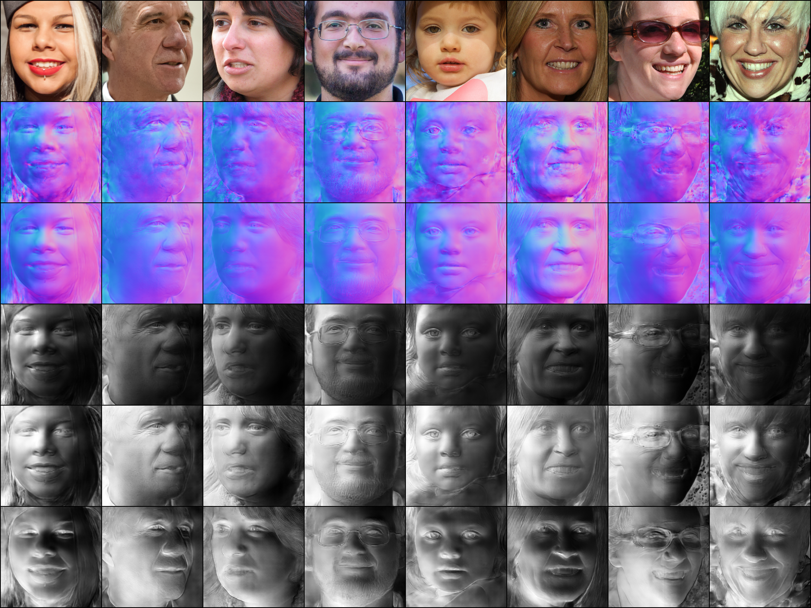

# HFFNE
 
This repository contains the official implementation of "Towards High-fidelity Face Normal Estimation" [Paper](https://dl.acm.org/doi/abs/10.1145/3503161.3547959), which appears in ACM Multimedia 2022.


<center></center>
From top to bottom are the input face, exemplar normal, refined normal and shadings.


### Testing
#### Download the training model from any of the following links： 
* [Google-cpkts](https://drive.google.com/drive/folders/1djzwMItmM0oZeNk9zkdNQqb_ZXw9Tomm?usp=sharing)
  
* [Baidu-cpkts](https://pan.baidu.com/s/1U-TW2J9vC4LtdmG_dMfMKQ?pwd=8bsm)
  
For testing run:
```
python test.py 
```

### License
HFFNE is available for free, under GPL license, to use for research and educational purposes only. 


### Contact
Mail: autohdr@gmail.com


### Citation
```
@inproceedings{wang2022towards,
  title={Towards High-Fidelity Face Normal Estimation},
  author={Wang, Meng and Wang, Chaoyue and Guo, Xiaojie and Zhang, Jiawan},
  booktitle={Proceedings of the 30th ACM International Conference on Multimedia},
  pages={5172--5180},
  year={2022}
}
```
